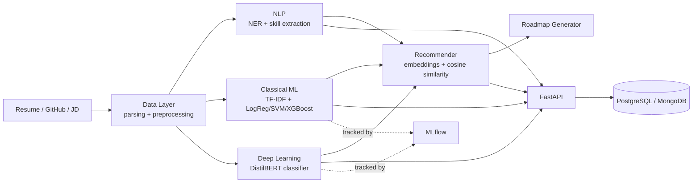

# Architecture

## Request flow (skill-gap analysis)

1. Client submits resume text + job description text to `POST /resume/missing-skills`.
2. `SkillExtractor` (spaCy PhraseMatcher / NER) extracts skills from both documents.
3. Missing skills = required − candidate skills.
4. `POST /recommend/rank-jobs` embeds resume + candidate JDs (sentence-transformers) and ranks by cosine similarity.
5. Roadmap generator turns missing skills into an ordered set of learning steps.

## Model tracking

All classical ML and DistilBERT training runs log params/metrics/artifacts to MLflow
(`mlflow_tracking_uri` in `.env`, default local `./mlruns`).
